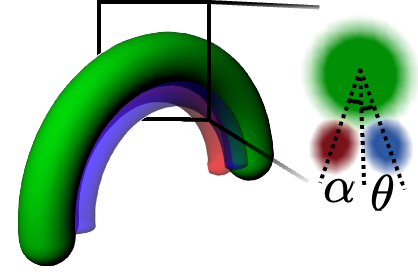
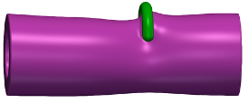

# Membrane SCFT with proteins

This code computes membrane structures and free energies in the presence of
curved, protein-like scaffolds. It combines self-consistent field theory (SCFT)
with the string method to study membrane deformation and pathways for fusion
or fission. CUDA accelerates the field calculations; MPI distributes replicas
(configurations along a pathway).

The membrane is represented by AB diblock copolymers: hydrophobic A blocks form
the membrane interior and hydrophilic B blocks form its surfaces. B homopolymers
represent the surrounding solvent. The calculation resolves their density fields
in a three-dimensional periodic box, rather than tracking individual atoms.

## Protein model

Proteins are prescribed, soft interaction potentials shaped like a curved tube:
a partial torus (an arc), a complete ring, or a pitched arc. They represent a
coarse-grained scaffold with tunable membrane-binding regions. The model uses
three overlapping fields:

- `prot1`: the backbone, which excludes lipid and favors solvent.
- `prot2`: a region favoring hydrophilic head groups over tails and solvent.
- `prot3`: a region favoring hydrophobic tails over head groups and solvent.

With positive strengths, these fields can model steric constriction, adhesion,
and insertion that splays lipid head groups. They are interaction potentials,
not protein densities or an atomistic model of a particular protein.



*Protein-model illustration: green backbone and two
colored interaction regions. Their positions and widths are adjustable.*



*Example research configuration: a green protein scaffold on a magenta membrane
tube. These illustrations explain the model; they are not outputs of the small
installation examples.*

The main geometry controls in `prot_input.dat` are:

| Input | Meaning |
|---|---|
| `P = Pr Py Pth` | Backbone radial thickness, arc centerline radius, angular extent (radians) |
| `Prx`, `pitch` | Backbone axial thickness; axial advance per full turn |
| `pro = pro1 pro2 pro3` | Strengths of the three fields, scaled by `chi[0]` in the solver |
| `hydrophilic_mode` | 0: head-group interaction along the backbone; 1: displaced patch |
| `mvin`, `patch_wx`, `patch_wy` | Patch displacement toward the inner side of the arc and patch widths |
| `patch_offset2`, `patch_offset3` | Patch angles around the backbone cross-section (radians) |
| `protein_enabled`, `protein_movable` | Enable the protein fields; allow protein motion during solving |

`P0s` sets each replica's position and starting arc angle; `qtns` sets its
orientation. Caps, reflection and tilt alignment are controlled below.

## Origin and publications

Derived from [SCFT_string](https://github.com/PolymerTheory/SCFT_string),
the membrane SCFT/string code accompanying Spencer et al.,
*Membrane fission via transmembrane contact*, **Nature Communications 15**, 2793
(2024), [doi:10.1038/s41467-024-47122-w](https://doi.org/10.1038/s41467-024-47122-w).
This repository is a derivative of that code, with protein-field extensions.

The protein-capable code lineage was used in R. K. W. Spencer and M. Müller,
*Dynamin optimizes protein-membrane interactions for fission*, **npj Soft Matter 2**,
6 (2026), [doi:10.1038/s44431-026-00018-9](https://doi.org/10.1038/s44431-026-00018-9).
This repository provides a cleaned implementation with configurable arc geometry.

## Build and run

- **Solver:** Linux, NVIDIA CUDA-capable GPU, CUDA/CUFFT, MPI, C++ compiler,
  HDF5 development libraries and zlib.
- **Python is not required to build or run the solver.**
- **Optional CPU geometry preview:** C++ compiler; no GPU required. Python
  with NumPy/h5py is used only for its HDF5 export (VTK export needs no Python).
- **Examples, expected outputs and measured runtimes:** [examples/README.md](examples/README.md).

```sh
make -C src SCFT_STRN=4 USE_HDF5=1 NVCC='nvcc -ccbin mpicxx'
# Run inside a directory containing the input files:
mpiexec -n 1 /path/to/scft_gpu input.dat
```

Set `HDF5_DIR=/path/to/hdf5` when needed. Build for your GPU/toolchain;
executables are platform-specific. `SCFT_STRN` sets the compiled replica count.
One GPU/MPI rank can own several replicas.

## Input files

- `input.dat`: grid `m`, box lengths `D`, interactions `chi`, chain parameters
  `f`/`N`, ensemble `ens`/`Vc`, string controls and restart options.
- `prot_input.dat`: protein geometry, patches, motion and the switches below.
  Patch offsets are in radians; protein enable, arc extent, radius, pitch and
  patch widths are adjustable.
- `P0s`: one `x y z theta` row per replica.
- `qtns`: one normalized quaternion `w x y z` row per replica.
- Keyed inputs allow comments after `#`. Grid, positions, orientations and
  restart arrays must match `SCFT_STRN`.

| Protein switch | Values | Default |
|---|---|---|
| `protein_cap_mode` | 0: caps off; 1: aligned caps on | 1 |
| `protein_symmetrize` | 0: single; 1: add periodic z-reflection; 2: copy lower-z half to upper-z half | 0 |
| `protein_pivot_align` | 0: no shift; 1: preserve arc midpoint under y-axis tilts | 0 |

Additive reflection doubles values on reflection planes. Midpoint alignment
applies to y-axis tilts; cap centers use the aligned geometry, with the existing
anisotropic cap-axis treatment.

## Restarts and outputs

- `readwin=0`: analytical initial fields; `readwin=1`: load compatible restart fields.
- HDF5 restart `wins.h5`: `W1`, `W2`, `Wp`, each shaped
  `(SCFT_STRN, mx, my, mz)`.
- `concentrations.h5`: `rhoA`, `rhoB`, `rhoH`; block A is hydrophobic.
- `proteins.h5`: `prot1`, `prot2`, `prot3`; XDMF files provide visualization metadata.
- `FEs`: per-replica free energies. Lengths and energies use model units;
  physical conversions are separate.
- `dostring` enables string updates. `max_outer` (default 1000) and
  `field_iterations` (default 100) bound iteration work. Checkpoint precision
  can be 32 or 64 bits.
- Outputs are written to the working directory. Use separate run folders;
  assess composition/pressure residuals, energy stability and morphology before
  interpreting a calculation as converged.

## Tests and license

```sh
python -m pip install -r requirements.txt
python -m unittest discover -s tests
```

These optional Python tests cover cap/reflection switches and output-checker
failures. NumPy handles numerical arrays; h5py reads HDF5 files. See the
[example guide](examples/README.md) for what each demonstration checks.
Code: MIT license. Author-supplied illustrations have separate attribution in
[NOTICE.md](NOTICE.md). See [LICENSE.txt](LICENSE.txt) and [NOTICE.md](NOTICE.md).
